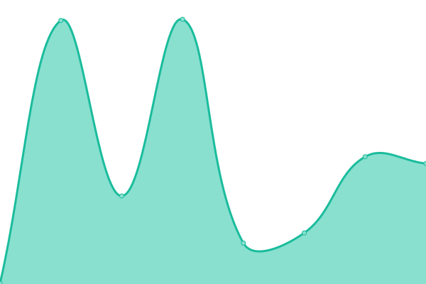
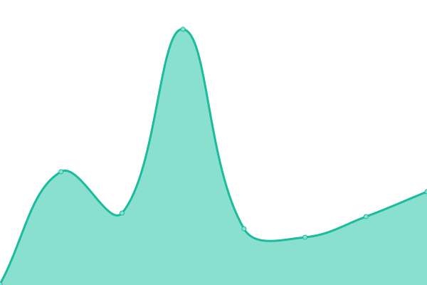
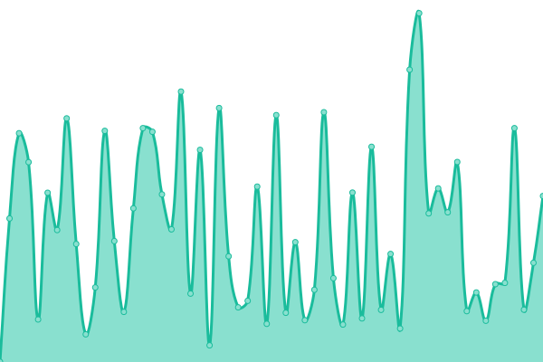
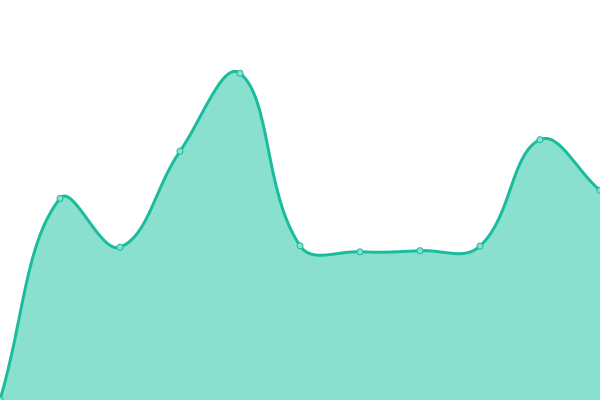
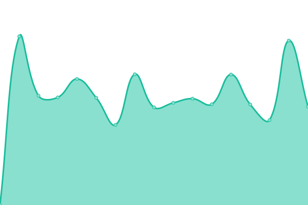

# [📈 Live Status](https://privacytime101.github.io/PipedStatus): <!--live status--> **🟧 Partial outage**

This repository contains the open-source uptime monitor and status page for [privacytime101](https://privacytime101.github.io/PipedStatus), powered by [Upptime](https://github.com/upptime/upptime).

With [Upptime](https://upptime.js.org), you can get your own unlimited and free uptime monitor and status page, powered entirely by a GitHub repository. We use [Issues](https://github.com/privacytime101/PipedStatus/issues) as incident reports, [Actions](https://github.com/privacytime101/PipedStatus/actions) as uptime monitors, and [Pages](https://privacytime101.github.io/PipedStatus) for the status page.

<!--start: status pages-->
<!-- This summary is generated by Upptime (https://github.com/upptime/upptime) -->
<!-- Do not edit this manually, your changes will be overwritten -->
<!-- prettier-ignore -->
| URL | Status | History | Response Time | Uptime |
| --- | ------ | ------- | ------------- | ------ |
|  [Kavin Rocks (🇺🇸, 游쉻릖, 游游, 游뻟릖, 🇬🇧 - CDN)](https://pipedapi.kavin.rocks) | 🟩 Up | [kavin-rocks-cdn.yml](https://github.com/privacytime101/PipedStatus/commits/HEAD/history/kavin-rocks-cdn.yml) | 

 633ms
     
 | 

<a href="https://piped.faith/history/kavin-rocks-cdn">98.15%</a>
    

|  [Tokhmi (🇺🇸 - CDN)](https://pipedapi.tokhmi.xyz) | 🟩 Up | [tokhmi-cdn.yml](https://github.com/privacytime101/PipedStatus/commits/HEAD/history/tokhmi-cdn.yml) | 

 472ms
     
 | 

<a href="https://piped.faith/history/tokhmi-cdn">100.00%</a>
    

|  [Moomoo (🇬🇧 - CDN)](https://pipedapi.moomoo.me) | 🟩 Up | [moomoo-cdn.yml](https://github.com/privacytime101/PipedStatus/commits/HEAD/history/moomoo-cdn.yml) | 

 659ms
     
 | 

<a href="https://piped.faith/history/moomoo-cdn">100.00%</a>
    

|  [Syncpundit (🇺🇸, 🇬🇧, 游游 - CDN)](https://pipedapi.syncpundit.io) | 🟥 Down | [syncpundit-cdn.yml](https://github.com/privacytime101/PipedStatus/commits/HEAD/history/syncpundit-cdn.yml) | 

 115ms
     
 | 

<a href="https://piped.faith/history/syncpundit-cdn">0.00%</a>
    

|  [MHA (游游 - CDN)](https://api-piped.mha.fi) | 🟩 Up | [mha-cdn.yml](https://github.com/privacytime101/PipedStatus/commits/HEAD/history/mha-cdn.yml) | 

 672ms
     
 | 

<a href="https://piped.faith/history/mha-cdn">100.00%</a>
    

|  [Whatever Social (🇺🇸 - CDN)](https://watchapi.whatever.social) | 🟩 Up | [whatever-social-cdn.yml](https://github.com/privacytime101/PipedStatus/commits/HEAD/history/whatever-social-cdn.yml) | 

 618ms
     
 | 

<a href="https://piped.faith/history/whatever-social-cdn">100.00%</a>
    

|  [Garuda Linux (游游 - CDN)](https://piped-api.garudalinux.org) | 🟩 Up | [garuda-linux-cdn.yml](https://github.com/privacytime101/PipedStatus/commits/HEAD/history/garuda-linux-cdn.yml) | 

 923ms
     
 | 

<a href="https://piped.faith/history/garuda-linux-cdn">100.00%</a>
    

|  [Rivo (游뻟릖 - CDN)](https://pipedapi.rivo.lol) | 🟥 Down | [rivo-cdn.yml](https://github.com/privacytime101/PipedStatus/commits/HEAD/history/rivo-cdn.yml) | 

 122ms
     
 | 

<a href="https://piped.faith/history/rivo-cdn">0.01%</a>
    

|  [Aeong (🇰🇷 - CDN)](https://pipedapi.aeong.one) | 🟥 Down | [aeong-cdn.yml](https://github.com/privacytime101/PipedStatus/commits/HEAD/history/aeong-cdn.yml) | 

 172ms
     
 | 

<a href="https://piped.faith/history/aeong-cdn">0.00%</a>
    

|  [Kavin Rocks Libre (游游)](https://pipedapi-libre.kavin.rocks) | 🟩 Up | [kavin-rocks-libre.yml](https://github.com/privacytime101/PipedStatus/commits/HEAD/history/kavin-rocks-libre.yml) | 

 631ms
     
 | 

<a href="https://piped.faith/history/kavin-rocks-libre">100.00%</a>
    

|  [JaeFi (游游)](https://api.yt.jae.fi) | 🟩 Up | [jae-fi.yml](https://github.com/privacytime101/PipedStatus/commits/HEAD/history/jae-fi.yml) | 

 1113ms
     
 | 

<a href="https://piped.faith/history/jae-fi">100.00%</a>
    

|  [Mint (游뻟릖)](https://pa.mint.lgbt) | 🟩 Up | [mint.yml](https://github.com/privacytime101/PipedStatus/commits/HEAD/history/mint.yml) | 

 1135ms
     
 | 

<a href="https://piped.faith/history/mint">100.00%</a>
    

|  [IL (🇺🇸)](https://pa.il.ax) | 🟩 Up | [il.yml](https://github.com/privacytime101/PipedStatus/commits/HEAD/history/il.yml) | 

 663ms
     
 | 

<a href="https://piped.faith/history/il">100.00%</a>
    

|  [Privacy (🇩🇪)](https://piped-api.privacy.com.de) | 🟥 Down | [privacy.yml](https://github.com/privacytime101/PipedStatus/commits/HEAD/history/privacy.yml) | 

 0ms
     
 | 

<a href="https://piped.faith/history/privacy">0.28%</a>
    

|  [Esmailelbob (游뻟릖)](https://pipedapi.esmailelbob.xyz) | 🟩 Up | [esmailelbob.yml](https://github.com/privacytime101/PipedStatus/commits/HEAD/history/esmailelbob.yml) | 

 606ms
     
 | 

<a href="https://piped.faith/history/esmailelbob">100.00%</a>
    

|  [Project Segfault (游游)](https://api.piped.projectsegfau.lt) | 🟩 Up | [project-segfault.yml](https://github.com/privacytime101/PipedStatus/commits/HEAD/history/project-segfault.yml) | 

 1258ms
     
 | 

<a href="https://piped.faith/history/project-segfault">100.00%</a>
    

|  [PrivacyDev (🇺🇸)](https://api.piped.privacydev.net) | 🟩 Up | [privacy-dev.yml](https://github.com/privacytime101/PipedStatus/commits/HEAD/history/privacy-dev.yml) | 

 489ms
     
 | 

<a href="https://piped.faith/history/privacy-dev">100.00%</a>
    

|  [Palveluntarjoaja (游游)](https://pipedapi.palveluntarjoaja.eu) | 🟩 Up | [palveluntarjoaja.yml](https://github.com/privacytime101/PipedStatus/commits/HEAD/history/palveluntarjoaja.yml) | 

 1106ms
     
 | 

<a href="https://piped.faith/history/palveluntarjoaja">100.00%</a>
    

|  [Plibre (游쉻릖)](https://p.plibre.com) | 🟥 Down | [plibre.yml](https://github.com/privacytime101/PipedStatus/commits/HEAD/history/plibre.yml) | 

 0ms
     
 | 

<a href="https://piped.faith/history/plibre">0.00%</a>
    

|  [Smnz (🇩🇪)](https://pipedapi.smnz.de) | 🟩 Up | [smnz.yml](https://github.com/privacytime101/PipedStatus/commits/HEAD/history/smnz.yml) | 

 2404ms
     
 | 

<a href="https://piped.faith/history/smnz">91.48%</a>
    

|  [Adminforge (🇩🇪)](https://pipedapi.adminforge.de) | 🟩 Up | [adminforge.yml](https://github.com/privacytime101/PipedStatus/commits/HEAD/history/adminforge.yml) | 

 997ms
     
 | 

<a href="https://piped.faith/history/adminforge">100.00%</a>
    

|  [Whatever Tinfoil (🇩🇪)](https://watchapi.whatevertinfoil.de) | 🟩 Up | [whatever-tinfoil.yml](https://github.com/privacytime101/PipedStatus/commits/HEAD/history/whatever-tinfoil.yml) | 

 1014ms
     
 | 

<a href="https://piped.faith/history/whatever-tinfoil">100.00%</a>
    

|  [Qdi (🇺🇸)](https://pipedapi.qdi.fi) | 🟩 Up | [qdi.yml](https://github.com/privacytime101/PipedStatus/commits/HEAD/history/qdi.yml) | 

 601ms
     
 | 

<a href="https://piped.faith/history/qdi">100.00%</a>
    

<!--end: status pages-->

[**Visit our status website →**](https://privacytime101.github.io/PipedStatus)

## 📄 License

- Powered by: [Upptime](https://github.com/upptime/upptime)
- Code: [MIT](./LICENSE) © [privacytime101](https://privacytime101.github.io/PipedStatus)
- Data in the `./history` directory: [Open Database License](https://opendatacommons.org/licenses/odbl/1-0/)
